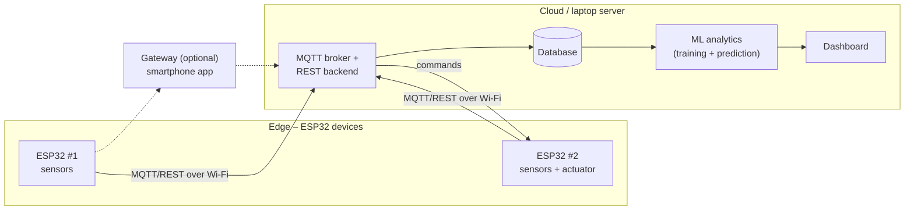

# CS3237 Group 3 – IoT Project

> NUS CS3237 Introduction to Internet of Things · AY2026/27 Sem 1
> **Status:** 🟡 Choosing an idea · **Next deadline:** Proposal – **Mon 28 Sep, 23:59** (Canvas)

A complete IoT system with ESP32 edge devices, an optional smartphone gateway and a cloud backend. It does **real-time processing at the edge** for critical events and **long-term ML analytics in the cloud**.

## 👥 Team

| Member | 
|---|
| Chang Shu Kai | 
| Loh Wern She | 
| Ng Ren Jie Daniel | 
| Tan Chyn | 
| Toh Xiang Yi Thomas | 

## 🗂️ Repository map

| Folder | What goes here |
|---|---|
| [`docs/`](docs/) | Project brief, idea pages, proposal, meeting notes, reports |
| [`docs/ideas/`](docs/ideas/) | The 6 candidate ideas + comparison, **start here** |
| [`hardware/`](hardware/) | Parts list & budget, wiring diagrams, enclosure / 3D-print files, datasheets |
| [`software/`](software/) | ESP32 firmware, gateway app, backend server, ML, dashboard |
| [`data/`](data/) | Info about collected sensor datasets (large files stay out of git) |

## 🏗️ System overview (generic, to be updated after we pick an idea)

Real-time decisions (e.g. triggering an actuator) happen **on the ESP32**; the cloud stores history and runs the ML.

## 📅 Timeline & grading

| When | Deliverable | Weight |
|---|---|---|
| Mon 28 Sep, 23:59 | Project proposal (Canvas) | 10% |
| Week 9 | Check-in 1 + Peer Review 1 | 5% |
| Week 11 | Check-in 2 (with demo) | 5% |
| Fri 13 Nov | Final demo + presentation | 20% |
| Fri 13 Nov, 23:59 | Final report (≤ 20 pages) | 15% |
| Weeks 9 & 13 | Peer reviews (both completed) | 5% |

Full summary of the spec: [`docs/project-brief.md`](docs/project-brief.md)

## 🤝 How we work

- **Discussion & tasks:** use GitHub **Issues** (one per task/question) and the **Projects** board.
- **Code changes:** make a branch (`firmware/rain-sensor`, `ml/drying-model` …) → open a **Pull Request** → someone else reviews → merge.
- **Meeting notes:** add a file to [`docs/meeting-notes/`](docs/meeting-notes/) using the template.
- **Never commit** Wi-Fi passwords, API keys or cloud credentials. Put them in `secrets.h` / `.env` (already in `.gitignore`).
